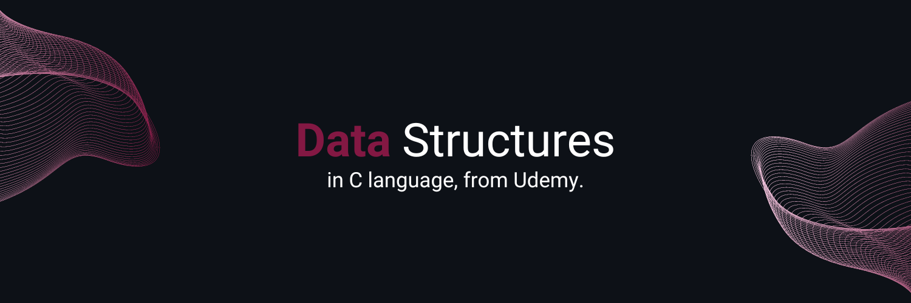

<h1>
  
</h1>

## About
This repository is about Udemy's C data structures course. I performed it in 2023 fully online. 
My goal was to learn about the main data structures and how to implement them.
Teacher: Leonardo de Abreu Schmidt.

## Languages and Tools

  

## Learned Content

1. Introduction to C language  
  a. Variables and data types  
  b. Conditional structures  
  c. Loops of Repetition  
  d. Functions  
  e. Vectors and Matrices  
2. Pointers
3. Structures
4. Dynamic allocation
5. Lists, queues and stacks
6. Recursion
7. Trees

[Certificado de Conclusão](https://github.com/Camifid/data-structures-c/files/12555400/CertificadoUdemy_AED.pdf)
